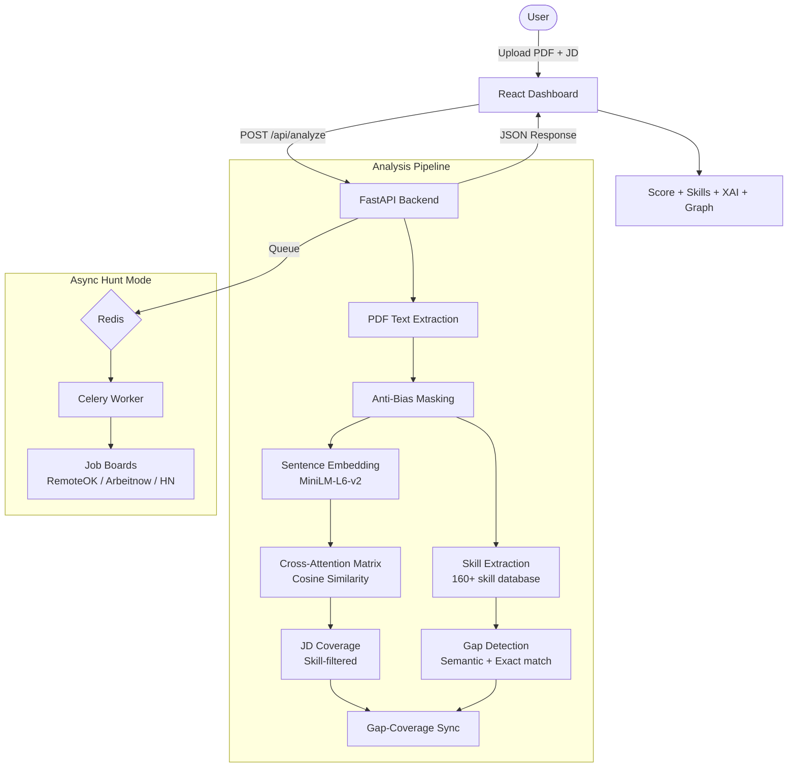

# 🛸 Cyber-Purple AI Resume Analyzer


---

## 📖 1. Overview

The **Cyber-Purple AI Resume Analyzer** is a full-stack recruitment intelligence platform that uses semantic NLP to compare resumes against job descriptions. Unlike simple keyword-matching ATS systems, it understands the *meaning* behind your experience and provides transparent, explainable results.

### Core Principles
- **Semantic Understanding**: BERT-based sentence embeddings capture intent and context, not just keywords.
- **Explainability (XAI)**: Every score is backed by a cross-attention matrix showing exactly which resume sentences match which JD requirements.
- **Fairness by Design**: Built-in bias auditing catches gendered language and tests the ML model for demographic scoring bias.
- **Actionable Gaps**: Missing skills are real, recognized technical terms — never random words or sentence fragments.

---

## ✨ 2. Features

### 🎯 Resume Analysis
- Upload a PDF resume and paste a job description
- Get an AI-powered **match score** (0–100%) with semantic similarity
- **Superpowers**: Skills detected in your resume that match the JD
- **Gaps**: Specific skills from the JD that are missing from your resume
- **JD Coverage**: Percentage of skill-relevant JD requirements your resume addresses

### 📈 Top 3 Improvements Summary
- Appears immediately after the score — no scrolling needed
- Dynamically generated from your actual analysis (not generic)
- Prioritizes: missing skills → low JD coverage → weak verbs → low skill count → missing metrics
- Each item shows **high/medium impact** badge for quick prioritization
- Also included in the downloadable PDF report

### 📥 Downloadable PDF Report
- Click **"Download Report"** next to the match score
- Generates a professional multi-page PDF with:
  - Color-coded match score and rating
  - Top 3 improvement priorities
  - Full Superpowers and Gaps lists
  - JD Coverage analysis breakdown
  - All AI advice recommendations
- Powered by jsPDF — no server-side rendering needed

### 🧠 Dynamic AI Advice Engine
- Context-aware advice based on your actual score, gaps, coverage, and verb analysis
- Color-coded advice cards: ✅ Success, 💡 Info, ⚠️ Warning, 🚨 Critical, 🎯 Tips, 🔧 Actions
- Each card has a typed icon, title, and personalized recommendation
- No two analyses produce the same generic advice

### 🔬 Explainability Panel (XAI)
- Sentence-by-sentence cross-attention heatmap
- **Visual arrow connectors** between matched resume ↔ JD sentences
- **"Your Resume Says" → "JD Requires"** labels for clarity
- **Strength labels** with emoji indicators (🟢 Strong, 🔵 Moderate, 🟡 Weak, 🔴 Gap)
- **🥇🥈🥉 Medal icons** for top-ranked resume sentences
- **Dynamic coverage color**: green (75%+), cyan (50%+), yellow (25%+), red (<25%)
- Gap-aware coverage calculation — missing skills auto-mark related JD sentences as uncovered
- Non-relevant JD sentences (fluff) filtered from coverage calculations

### ⚖️ AI Strictness Slider
- **Lenient** (left): Forgiving matching, close semantic matches count
- **Standard** (center): Balanced scoring
- **Brutal** (right): Strict matching, requires strong semantic alignment
- Affects match score, gap detection threshold, and JD coverage percentage
- Compressed threshold range (0.35–0.45) for gradual, balanced slider effect

### ✏️ AI Bullet Rewriter (RAG-Enhanced)
- Click any missing skill to rewrite a resume bullet point
- Uses ChromaDB vector store for industry-standard examples
- Powered by Groq Llama-3-70b with STAR method (Situation, Task, Action, Result)

### 🕵️ Hunt Mode (Async Job Scraper)
- Background job scraping via Celery + Redis
- Sources: RemoteOK, Arbeitnow, HackerNews Jobs
- Auto-matches scraped jobs against your resume profile
- Non-blocking — results polled asynchronously

### 🛡️ Bias Auditing
- Gender-coded language detection (masculine/feminine word flagging)
- Age-bias regex pattern detection
- Adversarial demographic fairness testing (synthetic name perturbation across 4 demographic groups)
- Anti-bias mode: spaCy masks PERSON, ORG, and GPE entities before scoring

### 🎨 Cyber-Purple Design System
- Dark mode glassmorphism UI with animated mesh gradient backgrounds
- Light mode support via theme toggle
- Scan budget system (50 scans per session with reset button)
- Scan history with auto-save
- Real-time server telemetry display

---

## 🛠️ 3. Technology Stack

### Backend
| Component | Technology | Purpose |
| :--- | :--- | :--- |
| API Framework | FastAPI + Uvicorn | Async REST API with auto-generated Swagger docs |
| NLP Model | `all-MiniLM-L6-v2` (SBERT) | 384-dim sentence embeddings for semantic similarity |
| Linguistic Processing | spaCy (`en_core_web_sm`) | Sentence segmentation, NER, POS tagging |
| Skill Database | CSV (160+ curated skills) | Accurate skill extraction via regex word-boundary matching |
| Vector Store | ChromaDB | RAG knowledge retrieval for bullet rewriting |
| LLM | Groq (Llama-3-70b) | AI-powered resume bullet rewriting |
| Task Queue | Celery + Redis | Async background job scraping |
| PDF Parsing | pdfplumber | Text extraction from uploaded resumes |

### Frontend
| Component | Technology | Purpose |
| :--- | :--- | :--- |
| UI Library | React 19 | Component-based dashboard with concurrent rendering |
| Build Tool | Vite 7 | Fast HMR development server |
| Styling | Tailwind CSS 4 + Custom CSS | JIT utilities + Cyber-Purple design tokens |
| Charts | Chart.js (Doughnut, Radar) | Match score gauge and skill radar |
| Network Graph | react-force-graph-2d | Force-directed skill proximity visualization |
| PDF Export | jsPDF | Client-side PDF report generation |
| Icons | Lucide React | Lightweight SVG icon system |
| HTTP Client | Axios | API communication |

### Infrastructure
| Component | Technology | Purpose |
| :--- | :--- | :--- |
| Containerization | Docker + Docker Compose | Multi-service orchestration |
| Base Image | Python 3.10 (Debian slim) | Minimal footprint |
| Message Broker | Redis Alpine | Celery task state management |

---

## 🏗️ 4. Architecture



---

## 🧠 5. How Scoring Works

### A. Semantic Similarity
Both documents are encoded into 384-dimensional vectors using `all-MiniLM-L6-v2`:
```
Score = CosineSimilarity(resume_vector, jd_vector) × 155
```
The 1.55x multiplier normalizes raw cosine scores (which typically plateau around 0.65 for strong matches) into a human-readable 0-100 scale.

### B. Strictness Modifier
The slider adjusts the final score by up to ±20%:
- **Lenient** (0): Score scaled up by 30% max
- **Standard** (50): No modification
- **Brutal** (100): Score scaled down by 20%

### C. Skill Gap Detection (Two-Pass)
1. **Exact Match**: Direct string comparison between JD skills and resume skills
2. **Semantic Match**: For remaining skills, uses bulk cosine similarity with threshold:
   - Lenient: 0.45 — close semantic matches count
   - Standard: 0.57 — moderate
   - Brutal: 0.70 — needs strong semantic alignment

### D. JD Coverage (Skill-Filtered)
Only JD sentences containing actual skills or requirement keywords are counted toward coverage. Fluff sentences like "we offer competitive benefits" are excluded. Coverage threshold:
- Lenient: 0.35 | Standard: 0.40 | Brutal: 0.45

**Gap-Coverage Sync**: After computing missing skills, any JD sentence containing a missing skill is retroactively marked as "uncovered", ensuring gaps and coverage are consistent.

---

## 📁 6. Project Structure

```
resume-analyzer/
├── docker-compose.yml          # Multi-service orchestration
├── README.md                   # This file
│
├── backend/
│   ├── Dockerfile              # Python 3.10 + CPU-only PyTorch
│   ├── requirements.txt        # Python dependencies
│   ├── .env                    # GROQ_API_KEY
│   ├── app.py                  # FastAPI routes & orchestration
│   ├── skill_extractor.py      # Curated DB matching + NLP discovery
│   ├── similarity_model.py     # SBERT embeddings & cosine similarity
│   ├── recommendation_engine.py # Two-pass gap detection engine
│   ├── explainability.py       # Cross-attention XAI matrix builder
│   ├── nlp_analyzer.py         # PII masking, action verbs, entity extraction
│   ├── bias_auditor.py         # Gender/age bias detection & adversarial testing
│   ├── resume_parser.py        # PDF text extraction via pdfplumber
│   ├── rag_engine.py           # ChromaDB vector store initialization
│   ├── llm_rewriter.py         # Groq LLM bullet point rewriter
│   ├── tasks.py                # Celery async job scraping tasks
│   └── master_experience.txt   # RAG knowledge base source
│
├── frontend/
│   ├── Dockerfile              # Node.js + Vite build
│   ├── src/
│   │   ├── App.jsx             # Main dashboard (state, layout, all panels)
│   │   ├── api.js              # Axios API client
│   │   ├── index.css           # Cyber-Purple design system tokens
│   │   ├── ExplainabilityPanel.jsx  # XAI heatmap & coverage panel
│   │   ├── FairnessReport.jsx  # Bias audit results display
│   │   ├── SkillGraph.jsx      # Force-directed skill proximity graph
│   │   ├── AIExtensions.jsx    # Terminal, Radar, Telemetry widgets
│   │   └── main.jsx            # React entry point
│   └── index.html              # HTML shell
│
└── datasets/
    └── skills_database.csv     # 160+ curated technical skills
```

---

## 🚀 7. Setup & Running

### Prerequisites
- Docker Desktop (recommended) OR Python 3.10+ and Node.js 20+
- Groq API key (free at [console.groq.com](https://console.groq.com))

### A. Docker Deployment (Recommended)
```bash
# 1. Clone and navigate
cd resume-analyzer

# 2. Create backend/.env
echo "GROQ_API_KEY=your_key_here" > backend/.env

# 3. Build and run
docker-compose up --build -d

# 4. Access
# Frontend:  http://localhost:5173
# Backend:   http://localhost:8000
# Swagger:   http://localhost:8000/docs

### ⚡ 7.1 Windows Quick Start (Recommended)
If you are on Windows, you can use the provided shortcuts in the root directory:
- **`run.bat`**: Double-click to start all services and open the dashboard in your browser.
- **`stop.bat`**: Double-click to safely shut down all services.

> [!NOTE]
> Make sure **Docker Desktop** is running before using these scripts.

---

## ☁️ 8. Free Forever Deployment (Render + Vercel)

This project is optimized for a **Zero-Cost** deployment using the "Hybrid Cloud" model. This avoids "Trial Limits" and keeps all features (Celery + Redis) active for free.

### 🗺️ Infrastructure Strategy
- **Frontend**: [Vercel](https://vercel.com) (Global CDN, $0)
- **Backend + Redis + Worker**: [Render](https://render.com) (Standard Web Service, $0)
  - We use a "Mega-Container" strategy that runs Redis and Celery inside the same instance to stay within the free tier.

---

### Step 1: Deploy Backend (Render)
1. Sign up for a free account at [Render.com](https://render.com).
2. Click **New +** -> **Web Service**.
3. Connect your GitHub repository.
4. Use these settings:
   - **Name**: `resume-analyzer-backend`
   - **Region**: Choose the one closest to you.
   - **Runtime**: `Docker`
   - **Plan**: `Free`
5. Add **Environment Variables**:
   - `GROQ_API_KEY`: Your key from [console.groq.com](https://console.groq.com).
   - `PYTHONUNBUFFERED`: `1`
6. Click **Create Web Service**. 
   - *Note: Your URL will look like `https://xxx.onrender.com`. Copy this!*

### Step 2: Deploy Frontend (Vercel)
1. Sign up for a free account at [Vercel.com](https://vercel.com).
2. Click **Add New** -> **Project**.
3. Import your GitHub repository.
4. In **Project Settings**, scroll to **Environment Variables**:
   - **Key**: `VITE_API_URL`
   - **Value**: `https://xxx.onrender.com/api/analyze` (Use your Render URL + `/api/analyze`)
5. Click **Deploy**.

---

> [!IMPORTANT]
> **Cold Starts**: Render's free tier "sleeps" after 15 minutes of inactivity. When you first visit your dashboard after a break, it might take ~30 seconds to wake up. This is normal.

> [!TIP]
> **All-in-One Container**: The Dockerfile automatically installs and manages its own internal Redis server, so you don't need any extra database accounts!

### B. Local Development (Without Docker)
```bash
# Backend
cd backend
pip install -r requirements.txt
python -m spacy download en_core_web_sm
uvicorn app:app --reload

# Frontend (separate terminal)
cd frontend
npm install
npm run dev
```

### Environment Variables
| Variable | Required | Description |
| :--- | :--- | :--- |
| `GROQ_API_KEY` | Yes | API key for Groq LLM (bullet rewriting) |
| `REDIS_URL` | Docker only | Redis connection string (defaults to `redis://redis:6379/0`) |
| `PYTHONUNBUFFERED` | Docker only | Set to `1` for real-time log output |

---

## 📡 8. API Reference

### `POST /api/analyze`
Main analysis endpoint. Accepts multipart form data.

| Parameter | Type | Default | Description |
| :--- | :--- | :--- | :--- |
| `resume` | File (PDF) | required | The resume to analyze |
| `job_description` | string | required | Job description text |
| `anti_bias_mode` | boolean | `false` | Enable PII masking before analysis |
| `strictness` | integer (0-100) | `50` | Scoring strictness level |

**Returns**: Match score, detected skills, missing skills, recommendations, verb analysis, skill proximity graph, XAI explainability data, and personal info.

### `POST /api/rewrite`
RAG-enhanced bullet point rewriter.

| Parameter | Type | Description |
| :--- | :--- | :--- |
| `original_bullet` | string | The original resume bullet point |
| `target_skill` | string | The skill to weave in |
| `job_role` | string | Target job role for context |

### `POST /api/hunt`
Starts async job scraping. Returns a `task_id` for polling.

### `GET /api/hunt-results/{task_id}`
Polls for hunt mode results by Celery task ID.

### `POST /api/bias-audit`
Runs bias analysis on a job description with optional adversarial model testing.

---

## 🎨 9. Design System

The Cyber-Purple theme is defined via CSS custom properties in `index.css`:

| Token | Dark Mode | Light Mode | Usage |
| :--- | :--- | :--- | :--- |
| `--bg-app` | `#0B0F19` | `#FFFFFF` | Page background |
| `--bg-card` | `#1A1F2E` | `#F9FAFB` | Card surfaces |
| `--accent-primary` | `#B829FF` | `#B829FF` | Primary actions, logos |
| `--accent-secondary` | `#00E5FF` | `#00E5FF` | Radar, telemetry accents |
| `--accent-success` | `#00FF88` | `#00FF88` | High match scores |
| `--accent-danger` | `#FF4D6A` | `#FF4D6A` | Gaps, warnings |

Key animations: `meshMove1/2/3` (background blobs), `scoreReveal` (score counter), `slideUp` (staggered card reveals), `skeleton-shimmer` (loading states), `radar-spin` (tech radar).

---

## 🛡️ 10. Bias Auditing

### Gender-Coded Language Detection
Based on Gaucher, Friesen & Kay (2011). Flags masculine-coded terms (aggressive, ninja, rockstar, 10x) and feminine-coded terms (nurture, compassion, collaborative) that can discourage diverse applicants.

### Age-Bias Detection
Regex patterns catch phrases like "digital native", "recent graduate only", "15+ years required" that create arbitrary barriers.

### Adversarial Fairness Testing
Runs the same resume with 4 demographic name sets (Western, African American, East Asian, Middle Eastern). A >2% score variance triggers a bias alert.

---

## ❓ 11. Troubleshooting

| Problem | Solution |
| :--- | :--- |
| Match score stays at 0% | Ensure the PDF is text-searchable, not a scanned image |
| Scan budget exhausted | Click the clock icon → **Reset Budget** |
| Backend not connecting | Check Docker logs: `docker-compose logs backend` |
| Skills not detected | The skills database has 160+ entries; check if your skill terminology matches |
| Hunt mode not working | Requires Redis and Celery worker to be running |

---

## 📝 12. Roadmap

- **v2.6**: Multi-page academic CV support and LinkedIn CSV import
- **v3.0**: Include XAI heatmap and fairness audit in the PDF report
- **v3.5**: Local LLM endpoint (Llama-3-8B) for fully private analysis

---

*Built with semantic AI, designed for transparency.*
